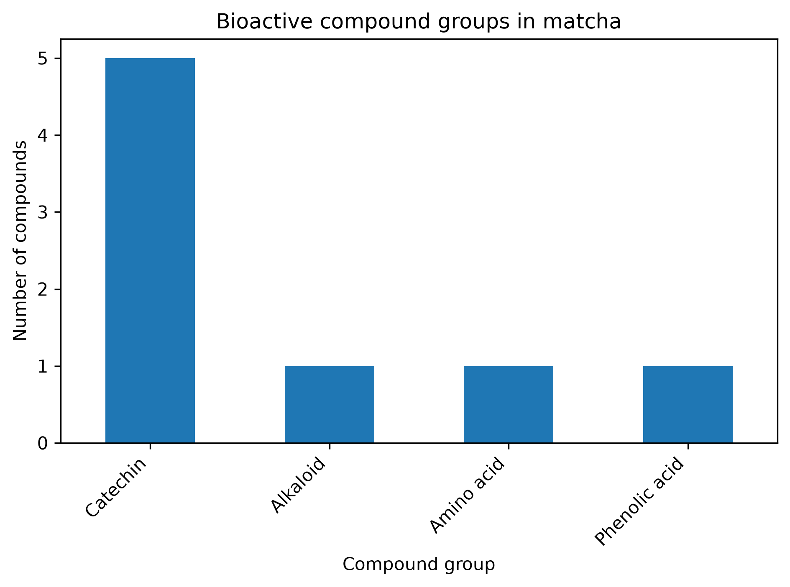
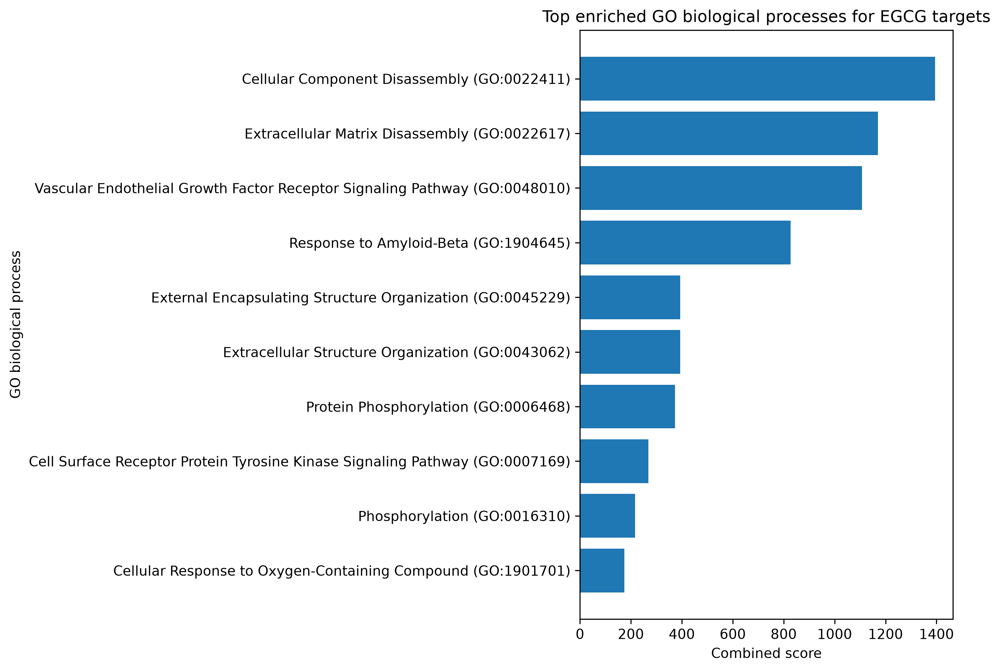
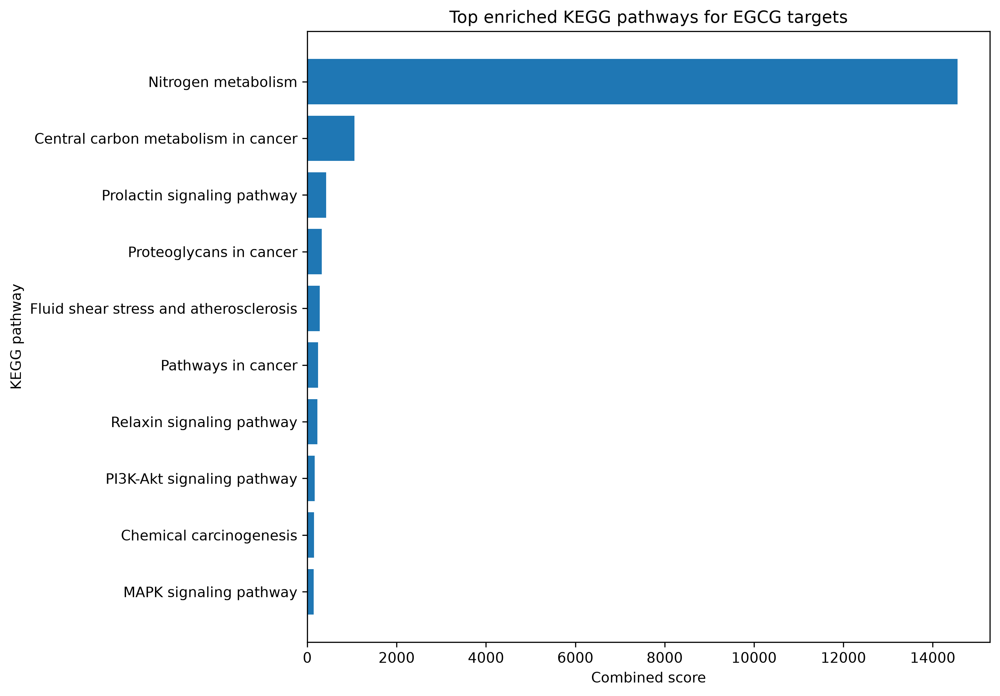
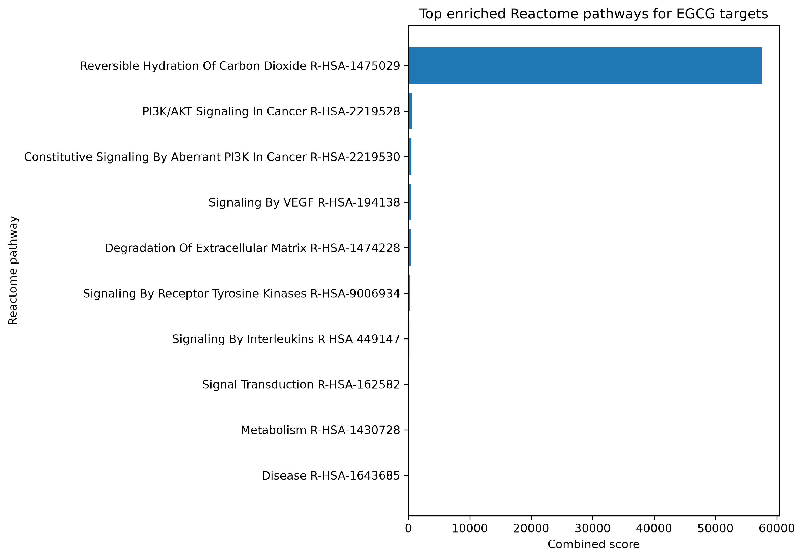
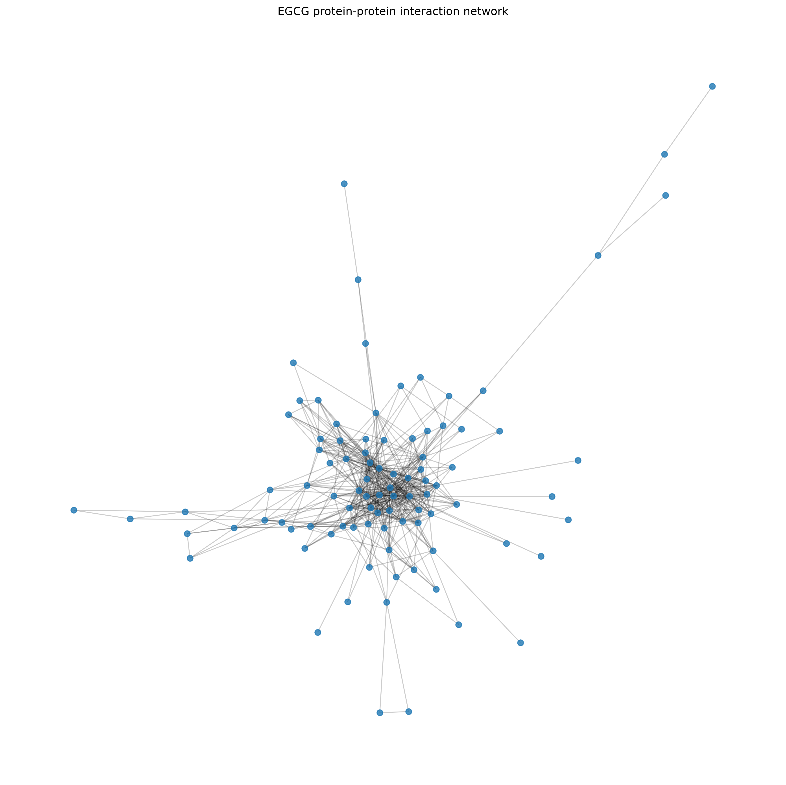
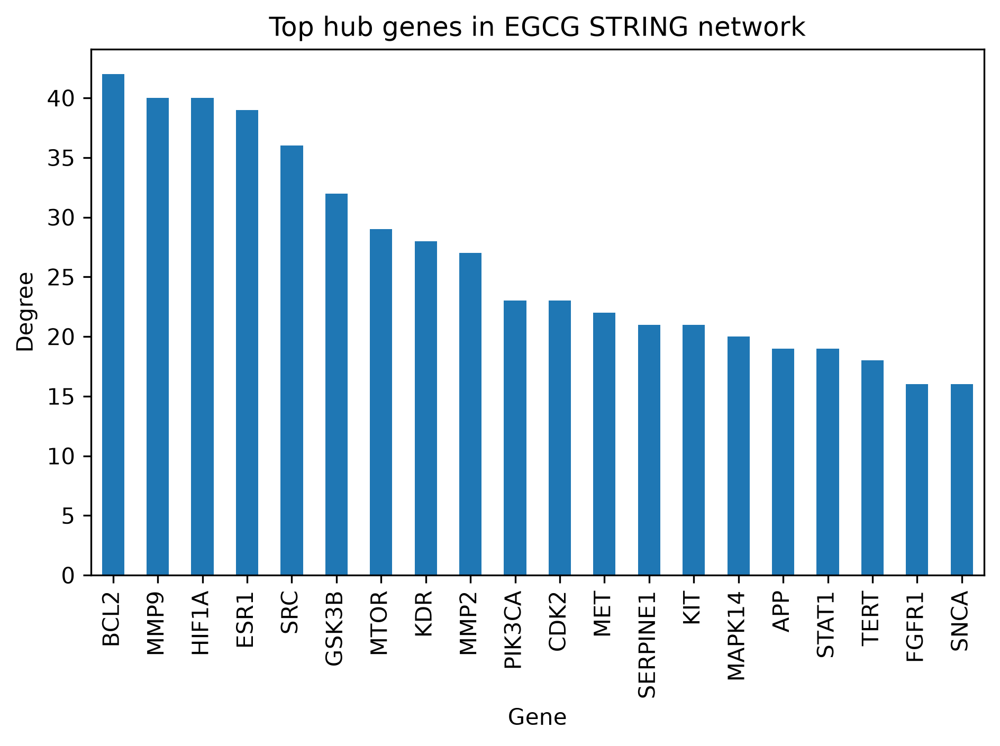
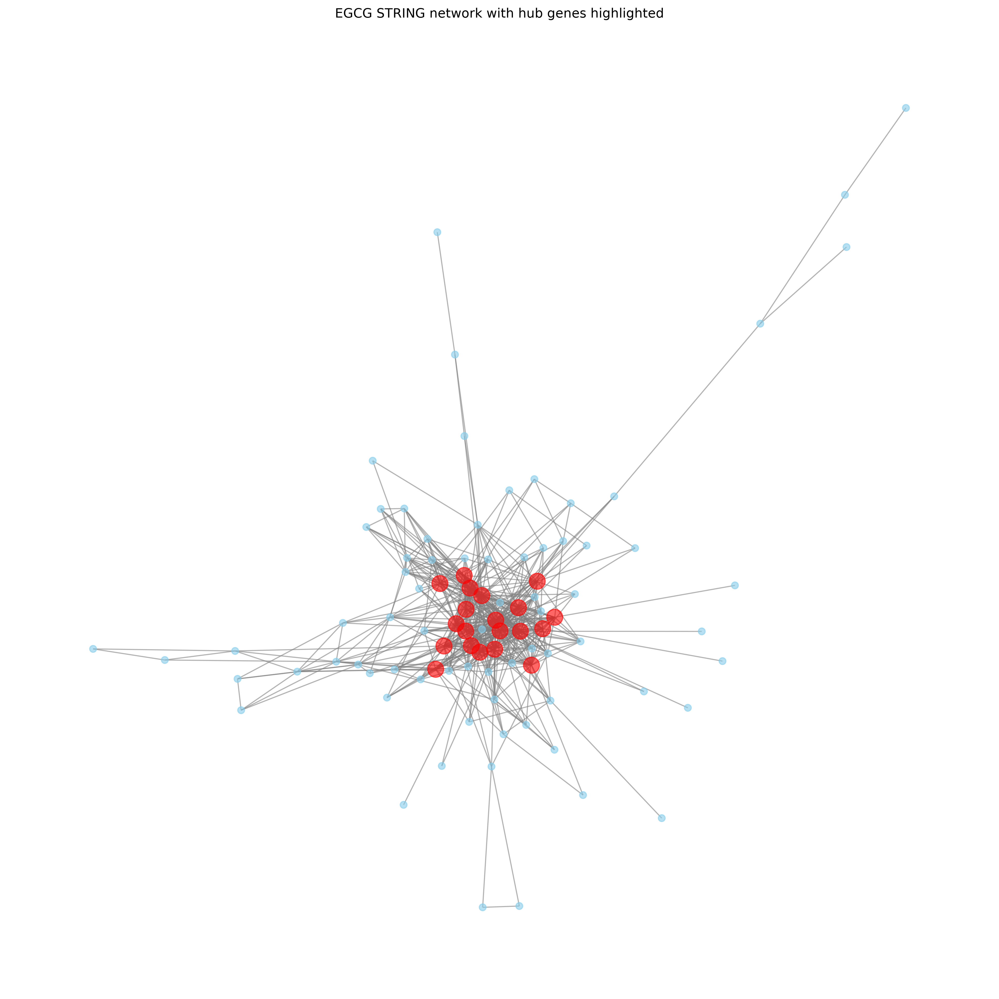

# 🍵 Molecular and Systems-Level Effects of Matcha on Human Health

## Bioinformatics Mini-Project

This repository presents an exploratory bioinformatics analysis investigating the potential molecular mechanisms of the major bioactive compounds found in **matcha green tea**, with a primary focus on **Epigallocatechin gallate (EGCG)**.

The project combines publicly available databases, pathway enrichment analysis and protein–protein interaction (PPI) network analysis to identify biological pathways and molecular targets potentially influenced by EGCG.

---

# Project Objectives

The objectives of this project were to:

- Identify the major bioactive compounds present in matcha.
- Retrieve chemical information from PubChem.
- Predict human protein targets using SwissTargetPrediction.
- Perform Gene Ontology (GO), KEGG and Reactome pathway enrichment analyses.
- Construct a protein–protein interaction network using STRING.
- Identify highly connected hub genes.
- Visualize molecular interaction networks.

---

# Workflow

```
Matcha bioactive compounds
            │
            ▼
     PubChem annotation
            │
            ▼
 SwissTargetPrediction
            │
            ▼
 Gene annotation
            │
            ▼
GO / KEGG / Reactome
 Functional enrichment
            │
            ▼
STRING PPI Network
            │
            ▼
Hub Gene Analysis
            │
            ▼
Network Visualization
```

---

# Repository Structure

```
MI-Matcha-SystemsBio
│
├── data/
│   └── external/
│
├── notebooks/
│   ├── 01_compound_overview.ipynb
│   ├── 02_pubchem_annotation.ipynb
│   ├── 03_target_collection.ipynb
│   ├── 04_functional_enrichment.ipynb
│   ├── 05_network_analysis.ipynb
│   └── 06_visualization_cytoscape.ipynb
│
├── outputs/
│   ├── figures/
│   ├── enrichment/
│   └── networks/
│
├── requirements.txt
└── README.md
```

---

# Bioactive Compounds

The following matcha-derived compounds were investigated:

- Epigallocatechin gallate (EGCG)
- Epigallocatechin (EGC)
- Epicatechin gallate (ECG)
- Epicatechin (EC)
- Catechin
- Gallic acid
- Caffeine
- L-theanine

---

# Results

## Bioactive compound groups



The analysed compounds belong primarily to the catechin group, together with caffeine, L-theanine and gallic acid.

---

## Gene Ontology (GO) enrichment



GO Biological Process enrichment identified pathways related to:

- extracellular matrix organisation
- protein phosphorylation
- VEGF receptor signalling
- cellular component disassembly
- cellular response to oxygen-containing compounds

---

## KEGG pathway enrichment



KEGG pathway analysis highlighted several biologically relevant pathways including:

- PI3K–Akt signalling
- MAPK signalling
- Relaxin signalling
- Pathways in cancer
- Proteoglycans in cancer
- Fluid shear stress and atherosclerosis

---

## Reactome pathway enrichment



Reactome enrichment identified pathways associated with:

- PI3K/AKT signalling
- VEGF signalling
- Receptor tyrosine kinase signalling
- Signal transduction
- Interleukin signalling
- Extracellular matrix degradation

---

## Protein–Protein Interaction Network



A protein–protein interaction network was generated using the STRING database. The resulting network consisted of approximately **96 proteins connected by over 500 protein–protein interactions**, demonstrating extensive functional connectivity among predicted EGCG targets.

---

## Hub Gene Analysis



Degree centrality analysis identified several highly connected proteins, including:

- BCL2
- MMP9
- HIF1A
- ESR1
- SRC
- GSK3B
- MTOR
- KDR
- MMP2
- PIK3CA

These genes represent important hubs within the interaction network and may contribute to multiple biological processes influenced by EGCG.

---

## STRING Network with Highlighted Hub Genes



Hub genes are highlighted in red, illustrating their central position within the protein–protein interaction network.

---

# Main Findings

The computational analyses suggest that EGCG may influence biological processes involved in:

- oxidative stress response
- extracellular matrix remodelling
- angiogenesis
- inflammation
- protein phosphorylation
- signal transduction
- PI3K–Akt signalling
- MAPK signalling
- VEGF signalling

Network analysis identified BCL2, MMP9, HIF1A, ESR1 and MTOR as major hub genes that may play central regulatory roles.

---

# Software and Databases

### Programming

- Python 3

### Python libraries

- pandas
- numpy
- matplotlib
- networkx
- requests
- gseapy

### Databases

- PubChem
- SwissTargetPrediction
- STRING
- Enrichr
- Reactome
- KEGG
- Gene Ontology

---

# Installation

Clone the repository:

```bash
git clone https://github.com/YOUR_USERNAME/MI-Matcha-SystemsBio.git

cd MI-Matcha-SystemsBio
```

Install dependencies:

```bash
pip install -r requirements.txt
```

Run the notebooks sequentially from **01** to **06**.

---

# Scientific Disclaimer

This project represents an exploratory bioinformatics analysis.

Predicted molecular targets, pathway enrichment analyses and protein interaction networks are computational predictions and should not be interpreted as evidence of therapeutic efficacy or causality.

Experimental validation is required to confirm the biological mechanisms suggested by these analyses.

---

# Future Work

Future analyses may include:

- transcriptomic analysis using GEO datasets
- disease-association analysis (DisGeNET/Open Targets)
- molecular docking simulations
- molecular dynamics simulations
- integration of multi-omics datasets

---

# Author

**Agata**

Bioinformatics Research Internship

**MultiOmics Intelligence**

2026
